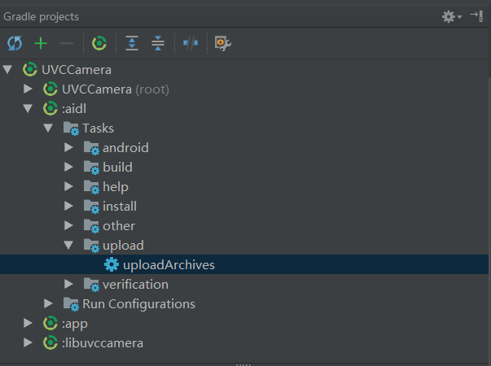

# UVCCamera
Android设备上打开外接USB Camera

参考：  
https://github.com/saki4510t/UVCCamera


- aidl library如何归档aar和doc, 并在github上把项目地址当作maven仓库发布   
参考[aidl/build.gradle](aidl/build.gradle)的编写，放开以下两个注释:   
//    archives androidJavadocsJar   
//    archives androidSourcesJar   

 

- 基于安装了UVCCamera.apk, 如何使用aidl library:   
```
allprojects {
    repositories {
        google()
        jcenter()
        maven { url 'http://raw.github.com/chengit163/UVCCamera/master/repository' }
    }
}

implementation 'com.cit:uvccamera-aidl:1.0.0'
```

- 基于安装了UVCCamera.apk, 使用aidl library的例子:   
[AVILibSample](https://github.com/chengit163/AVILibSample)   
[H264Demo](https://github.com/chengit163/H264Demo)   